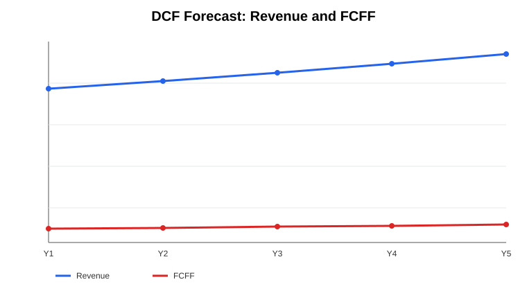

# Financial Modeling & DCF Valuation

A corporate-finance case that converts operating assumptions into a five-year projected model and discounted cash flow valuation.



## Base-case assumptions

- Revenue growth: 6.0%
- EBIT margin: 15.0%
- Tax rate: 29.5%
- D&A / Sales: 3.0%
- CAPEX / Sales: 4.0%
- NWC / Sales: 10.0%
- WACC: 10.5%
- Terminal growth: 3.0%
- Net debt: 220

## Projected model

The model projects **Revenue, EBITDA, EBIT, taxes, NOPAT, D&A, CAPEX, NWC and FCFF** before discounting the free cash flows.

```text
NOPAT = EBIT × (1 - Tax Rate)
FCFF = NOPAT + D&A - CAPEX - ΔNWC
Terminal Value = FCFF_(n+1) / (WACC - g)
Enterprise Value = PV(Explicit FCFF) + PV(Terminal Value)
Equity Value = Enterprise Value - Net Debt
```

### Base-case valuation

- Enterprise value: **1,403.32**
- Equity value: **1,183.32**

## Sensitivity analysis

The model evaluates equity value across WACC values from 9.0% to 12.0% and terminal growth rates from 2.0% to 4.0%. The base case at **10.5% WACC / 3.0% g** returns **1,183.32**.

The full matrix is available at `outputs/dcf_sensitivity.csv`.

## Files

- `dcf_model.py` — compact DCF implementation.
- `dcf_case.py` — expanded projected financial model, valuation, sensitivity matrix and chart generation.
- `outputs/dcf_forecast.csv` — projected operating and FCFF schedule.
- `outputs/dcf_sensitivity.csv` — WACC / terminal-growth sensitivity matrix.
- `outputs/dcf_forecast.svg` — portfolio-ready visual output.
- `requirements.txt` — dependencies.

## Run locally

```bash
pip install -r requirements.txt
python dcf_case.py
```

The script generates CSV outputs and PNG charts in an `outputs` folder.

## What this demonstrates

Financial statement projection · FCFF · DCF · WACC · terminal value · scenario analysis · valuation sensitivity · Python-based financial modeling

> All assumptions are illustrative and contain no confidential employer or client information.
