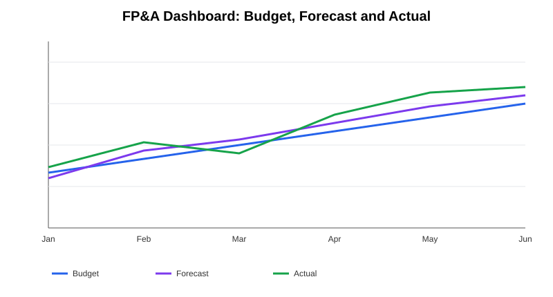

# FP&A — Budget, Forecast & Variance Analysis

A practical FP&A case focused on **budget vs. actual analysis, forecast accuracy and management reporting**.



## Objective

Translate a monthly budget / forecast / actual dataset into decision-oriented variance analysis.

## Metrics

- Absolute variance vs. budget
- Variance % vs. budget
- Forecast error
- Forecast error %
- Total budget vs. total actual

## Files

- `fpna_analysis.py` — builds the illustrative dataset and calculates variances.
- `fpna_dashboard.py` — exports the analysis and generates visual outputs.
- `outputs/fpna_dashboard.svg` — portfolio-ready trend visualization.
- `requirements.txt` — Python dependencies.

## Run locally

```bash
pip install -r requirements.txt
python fpna_analysis.py
python fpna_dashboard.py
```

## Management interpretation

The analysis is designed to answer three FP&A questions: **Where did spending deviate from plan? How accurate was the latest forecast? Which months should management investigate first?**

## What this demonstrates

Budgeting · Actual vs. Budget · Forecasting · Variance Analysis · Management Reporting · Python · Data Visualization

> All data is illustrative and contains no confidential employer information.
