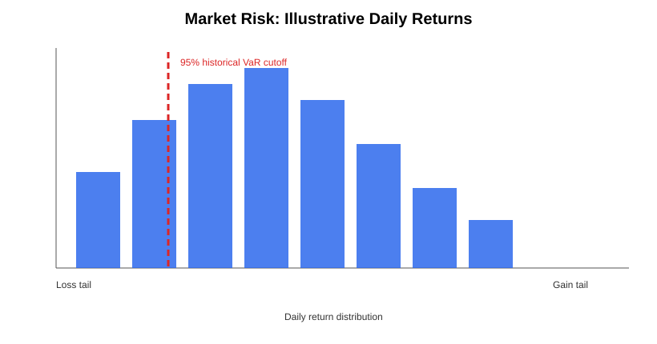

# Market Risk — Value at Risk (VaR)

A compact market-risk project comparing **parametric VaR** and **historical VaR** using an illustrative portfolio.



## Base case

- Portfolio value: 10,000,000
- Daily volatility: 0.12%
- Confidence level: 95%
- Holding period: 10 days

### Results

- Parametric 10-day VaR: approximately **62,418**
- Historical 1-day VaR: approximately **28,000**

## Methodology

Parametric VaR assumes normally distributed returns and scales daily volatility by the square root of time.

```text
VaR = Portfolio Value × z × Daily Volatility × √Holding Period
```

Historical VaR instead ranks the realized losses in the illustrative return sample and selects the loss corresponding to the chosen confidence level.

## Files

- `var_analysis.py` — VaR calculation functions.
- `var_dashboard.py` — exports outputs and generates a return-distribution chart.
- `outputs/var_distribution.svg` — visual risk output.
- `requirements.txt` — dependencies.

## Run locally

```bash
pip install -r requirements.txt
python var_analysis.py
python var_dashboard.py
```

## What this demonstrates

Market risk · volatility · parametric VaR · historical VaR · holding-period scaling · Python · risk visualization

> The return series and portfolio value are illustrative and intended only for educational and portfolio use.
